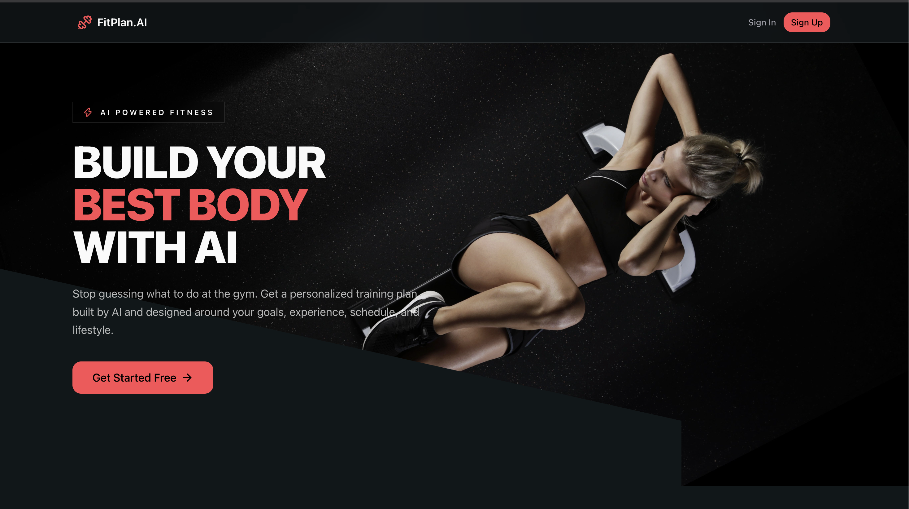

# 🏋️ FitPlan AI

> AI-powered fitness planner that generates personalized workout plans based on your goals, preferences, and fitness level.

## 📖 About The Project

FitPlan AI is a full-stack fitness planning application I built as a **learning-focused project**.

The main goal of this project was to practice building a complete application from frontend to backend, connecting it with a PostgreSQL database, implementing authentication, and integrating AI to generate personalized workout plans.

Rather than focusing only on the UI, this project helped me understand how different parts of a full-stack application work together.

---

## 🛠️ Tech Stack

### Frontend

- React
- TypeScript
- Vite
- React Router DOM
- Tailwind CSS
- shadcn/ui
- Lucide React

### Backend

- Node.js
- Express.js
- TypeScript
- REST API
- OpenAI SDK
- OpenRouter

### Database & Authentication

- PostgreSQL
- Prisma ORM
- Neon
- Neon Auth

---

## 🎯 What I Learned

This project was mainly focused on learning and improving my full-stack development skills.

### ⚛️ React & TypeScript

- Building reusable React components
- Managing application state
- Working with React Context
- Creating forms and handling user input
- Using TypeScript types and interfaces
- Working with React Router
- Protecting routes based on authentication state

### 🎨 Frontend Development

- Building responsive layouts with Tailwind CSS
- Using reusable UI components
- Working with shadcn/ui
- Creating modern dashboard and form interfaces
- Managing loading and error states
- Connecting a React frontend with a backend API

### 🖥️ Backend Development

- Creating an Express.js server
- Structuring a backend project
- Creating REST API routes
- Using middleware
- Handling requests and responses
- Working with environment variables
- Connecting frontend and backend applications

### 🗄️ Database & Prisma

- Setting up PostgreSQL
- Using Neon as a hosted PostgreSQL database
- Understanding Prisma ORM
- Creating database schemas
- Running Prisma migrations
- Querying and updating database records
- Connecting backend services with a database

### 🔐 Authentication

- Understanding authentication flow
- Integrating Neon Auth
- Working with authenticated users
- Protecting application routes
- Handling authentication state on the frontend

### 🤖 AI Integration

- Integrating an AI API into a full-stack application
- Using the OpenAI SDK with OpenRouter
- Creating prompts for personalized workout plans
- Sending user information to an AI model
- Working with structured AI responses
- Turning AI-generated data into application content

